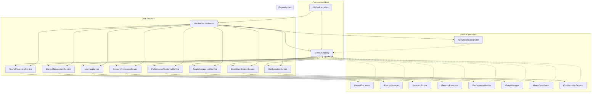
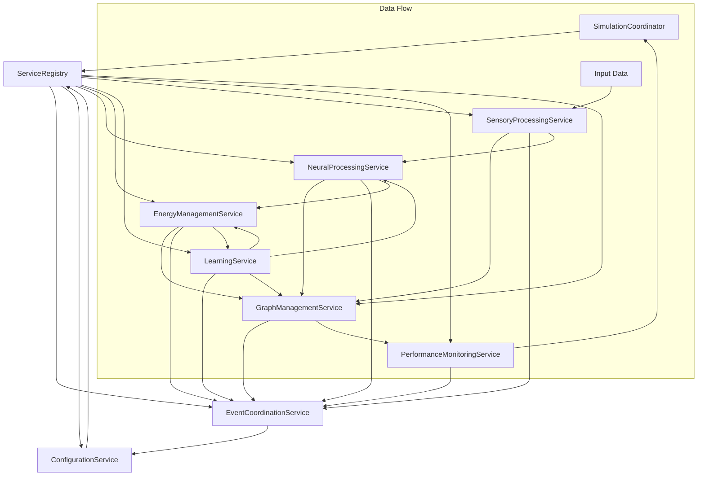
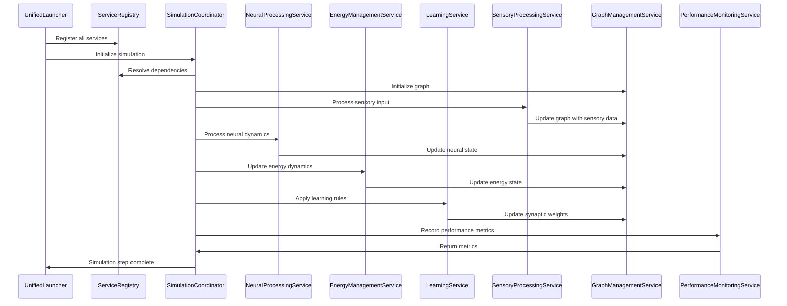

# AI Neural Simulation System - Consolidated Documentation

## Table of Contents
1. [Overview](#overview)
2. [Quick Start](#quick-start)
3. [System Architecture](#system-architecture)
4. [API Reference](#api-reference)
5. [Configuration](#configuration)
6. [Troubleshooting](#troubleshooting)
7. [Examples](#examples)

## Overview

The AI Neural Simulation System is a comprehensive, biologically-inspired neural network simulation platform that implements advanced neural dynamics, learning mechanisms, and real-time visualization. The system is designed for research, education, and development of biologically-inspired AI systems.

### Key Features

#### 🧠 Biologically-Inspired Neural Dynamics
- **STDP (Spike-Timing Dependent Plasticity)**: Timing-based synaptic plasticity
- **IEG Tagging**: Immediate Early Gene tagging for plasticity gating
- **Theta-Burst Stimulation**: High-frequency stimulation for LTP induction
- **Membrane Dynamics**: Realistic membrane potential modeling
- **Homeostatic Regulation**: Energy balance and criticality maintenance

#### 🔬 Advanced Learning Mechanisms
- **Hebbian Learning**: "Neurons that fire together, wire together"
- **Memory Formation**: Pattern recognition and long-term storage
- **Live Learning**: Real-time adaptation during simulation
- **Memory Consolidation**: Gradual strengthening of important patterns

#### 🎯 Real-Time Visualization
- **Dynamic Graph Visualization**: Real-time neural network display
- **Energy Flow Visualization**: Visual representation of energy dynamics
- **Performance Monitoring**: Real-time system metrics and health monitoring
- **Interactive Controls**: Live parameter adjustment and control

#### 🔧 System Architecture
- **Modular Design**: Clean separation of concerns with pluggable components
- **Event-Driven Processing**: Efficient processing using event queues
- **NASA Power of Ten Compliance**: Safety-critical coding standards
- **Static Memory Allocation**: Predictable performance characteristics

## Quick Start

### Installation
```bash
pip install -r requirements.txt
```

### Basic Usage with SOA
```python
from core.services.service_registry import ServiceRegistry
from core.services.simulation_coordinator import SimulationCoordinator
from core.services.neural_processing_service import NeuralProcessingService
from core.services.energy_management_service import EnergyManagementService
from core.services.learning_service import LearningService
from core.services.graph_management_service import GraphManagementService
from core.services.performance_monitoring_service import PerformanceMonitoringService
from core.services.configuration_service import ConfigurationService
from core.services.event_coordination_service import EventCoordinationService
from core.services.sensory_processing_service import SensoryProcessingService

# Create service registry
registry = ServiceRegistry()

# Register all services with dependency injection
registry.register_instance(ISimulationCoordinator, SimulationCoordinator(registry))
registry.register_instance(INeuralProcessor, NeuralProcessingService())
registry.register_instance(IEnergyManager, EnergyManagementService())
registry.register_instance(ILearningEngine, LearningService())
registry.register_instance(IGraphManager, GraphManagementService())
registry.register_instance(IPerformanceMonitor, PerformanceMonitoringService())
registry.register_instance(IConfigurationService, ConfigurationService())
registry.register_instance(IEventCoordinator, EventCoordinationService())
registry.register_instance(ISensoryProcessor, SensoryProcessingService())

# Get coordinator and initialize simulation
coordinator = registry.resolve(ISimulationCoordinator)
success = coordinator.initialize_simulation()
if success:
    coordinator.start_simulation()

    # Run simulation steps
    for step in range(1000):
        coordinator.run_simulation_step()

    coordinator.stop_simulation()
```

### Launch Options
```bash
# Launch with UI
python core/unified_launcher.py --profile ui

# Launch test suite
python core/unified_launcher.py --profile test

# Launch headless
python core/unified_launcher.py --profile headless
```

## System Architecture

### Service-Oriented Architecture (SOA)

The system has been fully migrated from a monolithic architecture to a service-oriented architecture (SOA) with dependency injection and interface-based design. The monolithic `SimulationManager` has been completely removed and replaced with 8 specialized services orchestrated by the `SimulationCoordinator`. Services are registered with a central `ServiceRegistry` and communicate through well-defined interfaces.

#### SOA Architecture Diagram



#### Service Dependencies Diagram



#### Data Flow Diagram



#### Core Services

##### 1. SimulationCoordinator (`core/services/simulation_coordinator.py`)
The central orchestrator service that coordinates all neural simulation services and manages the simulation lifecycle.

**Key Responsibilities:**
- Service dependency resolution through IServiceRegistry
- Simulation step orchestration across all services
- Graph state management through IGraphManager
- Event coordination through IEventCoordinator
- Performance monitoring via IPerformanceMonitor
- Configuration management through IConfigurationService
- Error handling and recovery through unified error handler

##### 2. ServiceRegistry (`core/services/service_registry.py`)
Central service registration and dependency injection container.

**Key Features:**
- Service registration and resolution by interface
- Singleton and transient service lifecycles
- Dependency validation and circular dependency detection
- Service initialization and cleanup
- Interface-based service contracts

##### 3. NeuralProcessingService (`core/services/neural_processing_service.py`)
Handles all neural dynamics and spiking behavior.

**Key Responsibilities:**
- Node behavior updates and state management
- Neural dynamics processing and integration
- Spike generation and propagation
- Enhanced neural system coordination
- Neural metrics calculation

##### 4. EnergyManagementService (`core/services/energy_management_service.py`)
Manages energy flow, conservation, and metabolic processes.

**Key Responsibilities:**
- Energy flow and consumption tracking
- Membrane potential dynamics
- Refractory period management
- Homeostatic energy regulation
- Energy conservation logic

##### 5. LearningService (`core/services/learning_service.py`)
Coordinates plasticity and learning mechanisms.

**Key Responsibilities:**
- Hebbian learning implementation
- STDP (Spike-Timing Dependent Plasticity)
- Memory trace formation
- Connection consolidation
- Plasticity updates based on neural activity

##### 6. SensoryProcessingService (`core/services/sensory_processing_service.py`)
Handles input processing and sensory data integration.

**Key Responsibilities:**
- Visual input processing and feature extraction
- Audio input integration
- Sensory pathway initialization
- Multi-modal sensory data integration
- Sensory-to-neural mapping

##### 7. GraphManagementService (`core/services/graph_management_service.py`)
Manages the neural graph structure and operations.

**Key Responsibilities:**
- Graph initialization and validation
- Node and edge management
- Graph integrity checking and repair
- Versioning and persistence operations
- Graph merging and transformation

##### 8. PerformanceMonitoringService (`core/services/performance_monitoring_service.py`)
System performance monitoring and metrics collection.

**Key Responsibilities:**
- Real-time performance metrics collection
- Memory usage tracking
- CPU utilization monitoring
- Simulation performance benchmarking
- Historical metrics storage and analysis

##### 9. EventCoordinationService (`core/services/event_coordination_service.py`)
Event-driven communication between services.

**Key Responsibilities:**
- Event publishing and subscription management
- Asynchronous event processing
- Service communication coordination
- Event-driven workflow orchestration

##### 10. ConfigurationService (`core/services/configuration_service.py`)
Centralized configuration management.

**Key Responsibilities:**
- Configuration file loading and parsing
- Runtime configuration updates
- Parameter validation and type checking
- Configuration persistence

#### 2. Neural Dynamics (`neural/`)
Implements neural processing and behavior management.

**Key Features:**
- Node behavior management via `behavior_engine.py`
- Intelligent connection formation via `connection_logic.py`
- Network analysis and metrics via `network_metrics.py`
- Event-driven processing via `event_driven_system.py`
- Spike processing via `spike_queue_system.py`

#### 3. Learning Engine (`learning/`)
Handles various learning mechanisms including energy-modulated Hebbian learning.

**Key Features:**
- STDP learning implementation via `learning_engine.py`
- Energy-modulated Hebbian learning via `live_hebbian_learning.py`
- Memory trace formation via `memory_system.py`
- Homeostatic regulation via `homeostasis_controller.py`
- Pattern recognition and connection consolidation

#### 4. Energy System (`energy/`)
Central energy management and integration system.

**Key Features:**
- Energy flow and consumption via `energy_behavior.py`
- Energy constants and parameters via `energy_constants.py`
- Node access layer via `node_access_layer.py`
- Node ID management via `node_id_manager.py`
- Energy integration validation via `energy_system_validator.py`

#### 5. Visualization (`ui/`)
Real-time visualization and user interface components.

**Key Features:**
- Dynamic graph visualization via `ui_engine.py`
- UI state management via `ui_state_manager.py`
- Performance metrics display
- Interactive controls
- Real-time data feeds

### Data Flow

```
Input Data → Sensory Processing → Neural Dynamics → Learning → Memory → Output
     ↓              ↓                ↓            ↓        ↓        ↓
Visual/Audio → Feature Extraction → STDP/IEG → Hebbian → Storage → Visualization
```

### Project Structure Summary

The project features a well-organized folder structure with specialized directories following SOA principles:

- **core/**: Core SOA infrastructure including `unified_launcher.py` (composition root), `services/` (8 SOA services), and `interfaces/` (service contracts).
- **config/**: Unified configuration management via `unified_config_manager.py`, with `config.ini` for settings.
- **utils/**: Consolidated utilities including `unified_error_handler.py` for error handling, `unified_performance_system.py`, `lazy_loader.py`, `performance_cache.py`, `static_allocator.py`, logging, and statistics utilities.
- **neural/**: Neural systems including `behavior_engine.py`, `connection_logic.py`, `network_metrics.py`, `event_driven_system.py`, and `spike_queue_system.py`.
- **energy/**: Energy management modules including `energy_behavior.py`, `energy_constants.py`, `node_access_layer.py`, `node_id_manager.py`, and `energy_system_validator.py`.
- **learning/**: Learning and memory systems including `learning_engine.py`, `live_hebbian_learning.py` (with energy modulation), `memory_system.py`, and `homeostasis_controller.py`.
- **sensory/**: Sensory integration (visual, audio) with `visual_energy_bridge.py`, `audio_to_neural_bridge.py`, and `sensory_workspace_mapper.py`.
- **ui/**: User interface and visualization with `ui_engine.py`, `ui_state_manager.py`, and `screen_graph.py`.
- **docs/**: Comprehensive documentation including README, API references, and specialized guides.
- **tests/**: Testing framework with comprehensive SOA integration tests, service mocking, and architecture validation tests.
- **analysis/**: Analysis and report files including test reports, energy validation reports, and performance metrics.

This SOA structure eliminates the monolithic `SimulationManager` and provides clean separation of concerns with dependency injection and interface-based design.

## API Reference

### Core Interfaces

#### ISimulationCoordinator
```python
class ISimulationCoordinator:
    def initialize_simulation(self) -> bool
    def start_simulation(self) -> bool
    def stop_simulation(self) -> bool
    def run_simulation_step(self) -> bool
    def reset_simulation(self) -> bool
    def get_simulation_state(self) -> SimulationState
    def get_neural_graph(self) -> Data
    def get_performance_metrics(self) -> Dict[str, Any]
    def update_configuration(self, config: Dict[str, Any]) -> bool
    def save_neural_map(self, slot: int) -> bool
    def load_neural_map(self, slot: int) -> bool
```

#### IServiceRegistry
```python
class IServiceRegistry:
    def register_instance(self, interface_type: Type, instance: Any) -> None
    def resolve(self, interface_type: Type) -> Any
    def has_service(self, interface_type: Type) -> bool
    def unregister(self, interface_type: Type) -> None
```

#### Enhanced Neural Integration
```python
# Enhanced neural integration is handled through multiple specialized systems:

# Node Behavior Management
from neural.behavior_engine import BehaviorEngine
behavior_engine = BehaviorEngine()
success = behavior_engine.update_node_behavior(node_id, graph, step, access_layer)

# Connection Logic
from neural.connection_logic import intelligent_connection_formation
graph = intelligent_connection_formation(graph)

# Network Metrics
from neural.network_metrics import NetworkMetrics
metrics = NetworkMetrics()
criticality = metrics.calculate_criticality(graph)
```

#### Learning Engine
```python
# Learning Engine - STDP and pattern learning
from learning.learning_engine import LearningEngine
from energy.node_access_layer import NodeAccessLayer

# Initialize access layer with graph
access_layer = NodeAccessLayer(graph)
learning_engine = LearningEngine(access_layer)
graph = learning_engine.consolidate_connections(graph)
graph = learning_engine.apply_memory_influence(graph)

# Live Hebbian Learning with energy modulation
from learning.live_hebbian_learning import create_live_hebbian_learning
learning = create_live_hebbian_learning(simulation_manager)
learning.energy_learning_modulation = True  # Enable energy-based learning
graph = learning.apply_continuous_learning(graph, step)

# Memory System
from learning.memory_system import MemorySystem
memory_system = MemorySystem()
graph = memory_system.form_memory_traces(graph)
graph = memory_system.consolidate_memories(graph)
```

### Utility Functions

#### Node Management
```python
# Node access and manipulation
get_node_by_id(graph, node_id: int) -> Optional[Dict[str, Any]]
select_nodes_by_type(graph, node_type: str) -> List[int]
select_nodes_by_behavior(graph, behavior: str) -> List[int]
```

#### Energy Management
```python
# Energy calculations and dynamics
get_node_energy_cap() -> float
update_node_energy_with_learning(graph, node_id, delta_energy) -> Data
apply_energy_behavior(graph, behavior_params=None) -> Data
```

## Configuration

### Configuration File (`config/config.ini`)
The system uses a comprehensive configuration file for all parameters:

```ini
[System]
time_step = 0.01
max_nodes = 100000
max_edges = 500000

[Learning]
learning_rate = 0.01
stdp_window = 0.1
plasticity_threshold = 0.3

[EnhancedNodes]
oscillator_frequency = 1.0
integrator_threshold = 0.8
relay_amplification = 1.5
highway_energy_boost = 2.0

[Performance]
update_interval = 1.0
history_size = 10
memory_warning_mb = 2000.0
```

### Environment Variables
```bash
# Set random seed
export NEURAL_SIMULATION_SEED=42

# Enable debug mode
export NEURAL_DEBUG=1

# Set log level
export NEURAL_LOG_LEVEL=INFO
```

## Troubleshooting

### Common Issues

#### 1. Memory Issues
**Problem**: High memory usage or out of memory errors
**Solution**: 
- Reduce `max_nodes` in configuration
- Enable garbage collection in performance monitor
- Use static memory allocation

#### 2. Performance Issues
**Problem**: Slow simulation or low FPS
**Solution**:
- Check system resources in performance monitor
- Reduce update frequency
- Optimize graph size

#### 3. Import Errors
**Problem**: Module import failures
**Solution**:
- Run `python core/unified_launcher.py --test-imports`
- Check requirements.txt installation
- Verify Python version compatibility

#### 4. Visualization Issues
**Problem**: UI not displaying or updating
**Solution**:
- Check DearPyGui installation
- Verify display settings
- Restart UI engine

### Debug Mode
Enable debug mode for detailed logging:
```python
import logging
logging.basicConfig(level=logging.DEBUG)
```

## Examples

### Basic Neural Network with SOA
```python
from core.services.service_registry import ServiceRegistry
from core.services.simulation_coordinator import SimulationCoordinator
from core.services.graph_management_service import GraphManagementService
from core.interfaces import ISimulationCoordinator, IGraphManager
from main_graph import create_test_graph

# Create service registry and register services
registry = ServiceRegistry()
registry.register_instance(ISimulationCoordinator, SimulationCoordinator(registry))
registry.register_instance(IGraphManager, GraphManagementService())

# Get coordinator and initialize
coordinator = registry.resolve(ISimulationCoordinator)
graph_manager = registry.resolve(IGraphManager)

# Create and set test graph
graph = create_test_graph(num_sensory=100, num_dynamic=50)
graph_manager.set_graph(graph)

# Initialize and run simulation
coordinator.initialize_simulation()
coordinator.start_simulation()

for step in range(1000):
    coordinator.run_simulation_step()

coordinator.stop_simulation()
```

### Enhanced Neural Dynamics
```python
from neural.behavior_engine import BehaviorEngine
from energy.node_access_layer import NodeAccessLayer

# Create behavior engine and access layer
behavior_engine = BehaviorEngine()
access_layer = NodeAccessLayer(graph)

# Update node behavior
success = behavior_engine.update_node_behavior(node_id, graph, step, access_layer)

# Get node energy and properties
energy = access_layer.get_node_energy(node_id)
behavior = access_layer.get_node_property(node_id, 'behavior')
```

### Energy-Modulated Learning with SOA
```python
# Energy-modulated learning where energy levels influence synaptic plasticity
from core.services.service_registry import ServiceRegistry
from core.services.learning_service import LearningService
from core.services.energy_management_service import EnergyManagementService
from core.interfaces import ILearningEngine, IEnergyManager

# Create registry and register services
registry = ServiceRegistry()
registry.register_instance(IEnergyManager, EnergyManagementService())
registry.register_instance(ILearningEngine, LearningService(registry))

# Get learning service
learning_service = registry.resolve(ILearningEngine)

# Enable energy modulation for biologically realistic learning
learning_service.enable_energy_modulation(True)

# Learning rates automatically adjust based on node energy levels:
# - High energy nodes (0.8+): 95% of base learning rate
# - Medium energy nodes (0.5): 75% of base learning rate
# - Low energy nodes (0.1): 55% of base learning rate

# Apply learning through service interface
graph = learning_service.apply_learning(graph, step)
```

---

*This consolidated documentation replaces the following files:*
- *API_REFERENCE.md*
- *TECHNICAL_DOCUMENTATION.md* 
- *PROJECT_SUMMARY.md*
- *EXAMPLES_AND_TUTORIALS.md*
- *TROUBLESHOOTING.md*
