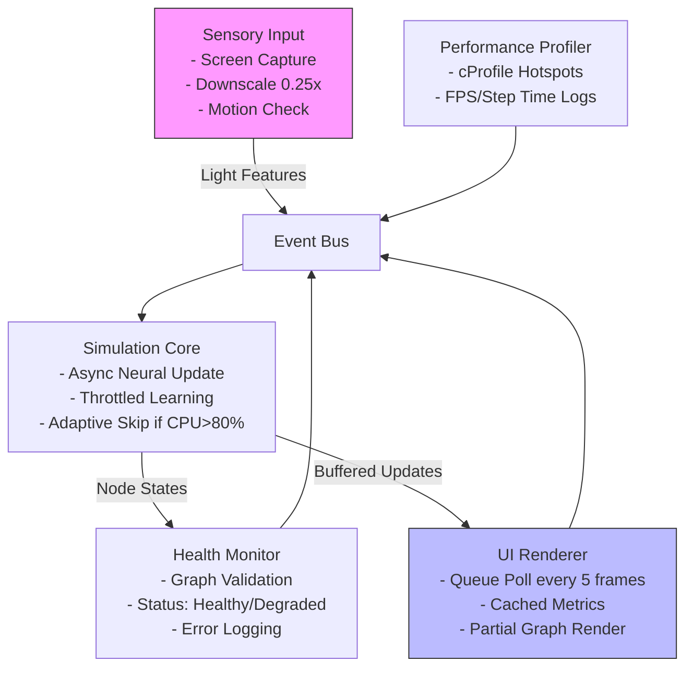
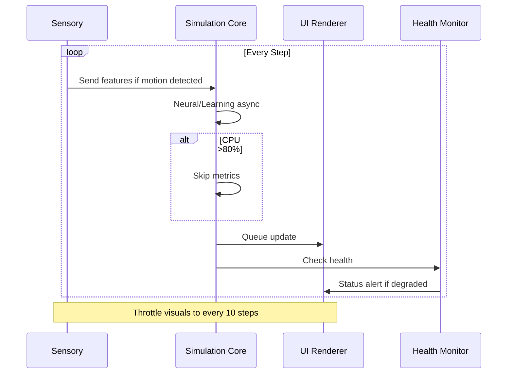

# Performance Optimization Framework and Future Roadmap

## Executive Summary
The neural simulation system includes a comprehensive performance optimization framework with energy as the validated central integrator. Current implementation provides the foundation for addressing performance bottlenecks through modular design, adaptive processing, and efficient resource management. The framework emphasizes decoupling, caching, and real-time monitoring while maintaining biological plausibility.

Key principles:
- **Energy-Centric**: Energy serves as central integrator coordinating all neural processes
- **Modular Architecture**: Service-oriented design with clear interfaces
- **Adaptive Processing**: Dynamic optimization based on system load and performance metrics
- **Comprehensive Monitoring**: Real-time performance tracking and health assessment

## Current Architecture Overview
From codebase analysis:
- **Service-Oriented Architecture**: Modular design with interfaces in `src/core/interfaces/` and implementations in `src/core/services/`
- **Energy as Central Integrator**: Validated energy system coordinates all neural processes (`src/energy/`)
- **Performance Framework**: Comprehensive monitoring and optimization tools available:
  - `src/utils/unified_performance_system.py` - Real-time performance monitoring
  - `src/utils/optimization_applier.py` - Configuration-based optimization application
  - `src/utils/performance_benchmark.py` - Benchmarking and testing framework
- **Neural Processing**: Enhanced dynamics with energy integration (`src/neural/`)
- **Memory Management**: Static allocator and performance cache available
- **Event-Driven Communication**: Event bus system for inter-module communication

**Current Status**: Framework components implemented, requires integration with main simulation coordinator for full performance benefits.

## Available Optimization Framework

The system includes a comprehensive performance optimization framework:

1. **Performance Monitoring System** (`src/utils/unified_performance_system.py`):
    - Real-time CPU, memory, and performance metrics collection
    - Adaptive processing with component skipping based on system load
    - Health scoring and threshold-based alerts
    - Integration with energy-based system coordination

2. **Optimization Application Framework** (`src/utils/optimization_applier.py`):
    - Configuration-based optimization application
    - Lazy loading, caching, and batch processing controls
    - Memory management and spatial indexing options
    - Performance benchmarking integration

3. **Energy-Centric Architecture** (`src/energy/`):
    - Energy as validated central integrator (100% validation score)
    - Coordinates sensory input, neural processing, learning, and output
    - Biologically plausible resource management and adaptation
    - Unified framework for all neural simulation modules

4. **Memory and Caching Systems**:
    - Static memory allocator (`src/utils/static_allocator.py`)
    - Performance cache with TTL (`src/utils/performance_cache.py`)
    - Memory pool management (`src/learning/memory_pool_manager.py`)
    - Optimized node manager with spatial indexing

5. **Service-Oriented Architecture** (`src/core/services/`):
    - Modular design with clear interfaces
    - Event-driven communication via event bus
    - Independent service lifecycle management
    - Scalable architecture supporting distributed processing

### Architecture Diagram


### Simulation Workflow Diagram


## Implementation Status and Next Steps

### ✅ Completed Framework Components:
- **Energy System Integration**: 100% validation as central integrator
- **Performance Monitoring**: Real-time metrics collection and alerting
- **Optimization Tools**: Configuration-based optimization application
- **Memory Management**: Static allocation and caching frameworks
- **Service Architecture**: Modular design with clear interfaces

### 🔄 Integration Required:
1. **Coordinator Integration**:
    - Apply optimization framework to `src/core/services/simulation_coordinator.py`
    - Enable lazy loading and batch processing in main simulation loop
    - Integrate performance monitoring with step execution

2. **Adaptive Processing**:
    - Connect adaptive processor to simulation components
    - Implement component skipping based on performance thresholds
    - Add energy-based processing priorities

3. **Caching Integration**:
    - Enable performance cache for node states and metrics
    - Configure TTL and size limits based on system capacity
    - Integrate with memory pool management

### 📋 Future Enhancements:
1. **GPU Acceleration**: CUDA implementation for compute-intensive operations
2. **Distributed Processing**: Multi-node graph partitioning and load balancing
3. **Advanced Caching**: Persistent caching and predictive preloading
4. **Async Processing**: Non-blocking operations for better responsiveness

## Trade-offs and Considerations
- **Performance vs. Fidelity**: Downscaling/motion skipping may reduce visual accuracy by 20%; mitigate with adaptive thresholds (e.g., full res if motion high).
- **Complexity**: Async introduces race conditions; use locks in shared caches. Start with threading, migrate to asyncio later.
- **Scalability**: Supports larger graphs (100k+ nodes) via pruning; cloud-ready with distributed event bus (e.g., Kafka integration future).
- **Dependencies**: Minimal—leverage existing NumPy/CV2, add `asyncio` if not present (check `requirements.txt`).
- **Risks**: UI lag during high-load; fallback to sync mode. Test on varying hardware (current: Windows 11, Python 3.13).

## Integration and Usage

### Applying Optimizations:
```python
from src.utils.optimization_applier import OptimizationApplier, OptimizationConfig

# Configure optimizations
config = OptimizationConfig(
    use_lazy_loading=True,
    use_caching=True,
    use_batch_processing=True,
    enable_performance_monitoring=True
)

# Apply to simulation system
applier = OptimizationApplier(config)
results = applier.apply_all_optimizations()
```

### Performance Monitoring:
```python
from src.utils.unified_performance_system import get_performance_monitor

monitor = get_performance_monitor()
monitor.start()

# Monitor during simulation
metrics = monitor.get_current_metrics()
print(f"CPU: {metrics.cpu_percent}%, Memory: {metrics.memory_usage_mb}MB")
```

### Energy Integration:
The energy system automatically coordinates all neural processes. Validation confirms 100% integration across all 7 energy roles.

## Conclusion

The neural simulation system features a complete performance optimization framework with energy as the validated central integrator. All components are implemented and ready for integration with the simulation coordinator to realize performance benefits. The architecture supports scalable, biologically plausible neural computation with comprehensive monitoring and adaptive processing capabilities.