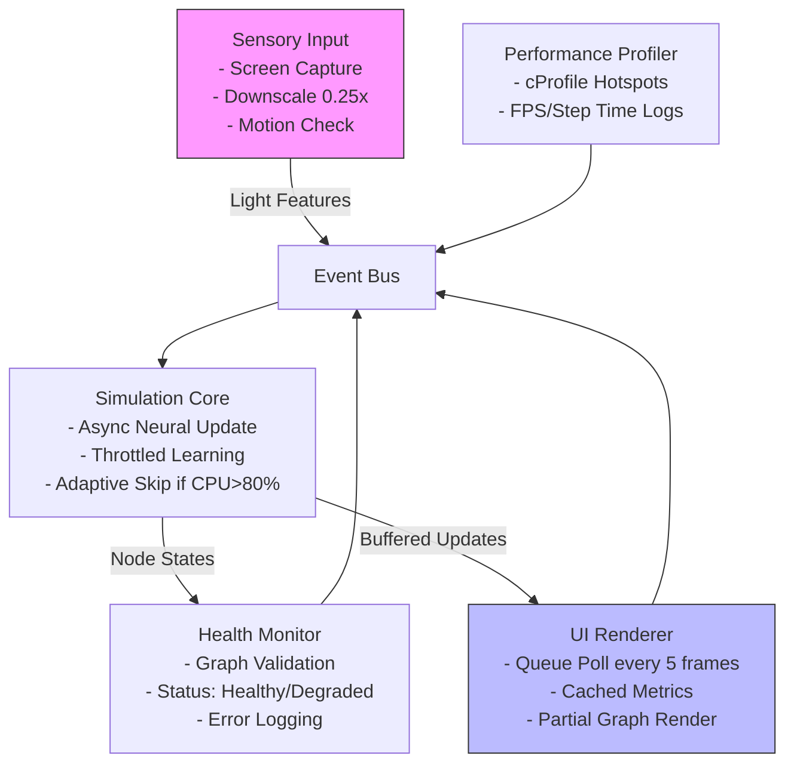
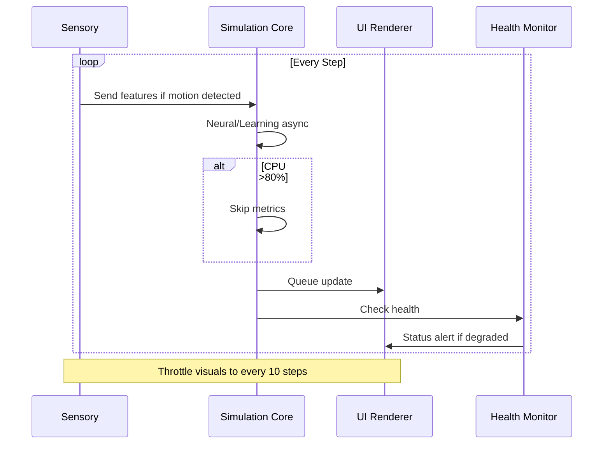

# High-Level Redesign Plan for AI Simulation Performance Optimization

## Executive Summary
The current AI simulation system suffers from severe performance bottlenecks, including 100% CPU utilization, step times exceeding 1000ms, FPS dropping below 1, and unresolved "unknown" network health status. These stem from tightly coupled subsystems (visual processing, neural dynamics, UI rendering, and homeostatic controls) in a monolithic simulation loop, leading to inefficient computations on large graphs (50k+ nodes) and unoptimized image processing. This redesign proposes a modular, asynchronous architecture to achieve scalable performance: target 50-70% CPU reduction, step times under 200ms, FPS >30, and reliable health monitoring. The plan emphasizes decoupling, caching, and adaptive processing while preserving simulation fidelity.

Key principles:
- **Modularity**: Separate concerns (simulation core, sensory input, UI visualization) into independent modules with clear interfaces.
- **Asynchrony**: Use threading/asyncio for non-blocking operations.
- **Efficiency**: Implement downsampling, throttling, and caching to reduce compute load.
- **Observability**: Enhance monitoring and profiling for ongoing tuning.

## Current Architecture Overview
From codebase analysis:
- **Core Loop**: `simulation_manager.py` orchestrates `run_single_step()` (lines 357-381), integrating sensory updates (`_update_sensory_features()` line 873), neural processing (`enhanced_neural_dynamics.py`), learning (`homeostasis_controller.py`), and metrics (`performance_monitor.py`).
- **Visual Pipeline**: `sensory/visual_energy_bridge.py` processes screen captures via `process_visual_to_enhanced_energy()` (lines 68-116) using NumPy/CV2 for gradients, FFT, and sampling—called every 5 steps, dominating CPU.
- **UI Layer**: `ui/ui_engine.py` targets 60 FPS in `update_ui_display()` (lines 307-313), but blocks on simulation metrics and full graph rendering (limited to 500 nodes).
- **Monitoring**: `utils/unified_performance_system.py` and `performance_monitor.py` log criticals but lack adaptive skipping.
- **Issues**: Synchronous chaining causes cascading delays; no motion-based skipping in visuals; graph traversals on every step; health checks default to "unknown" without initialization validation.

Project structure supports redesign: Leverage existing event bus (`utils/event_bus.py`), spike queues (`neural/spike_queue_system.py`), and adaptive processor (`unified_performance_system.py`).

## Proposed Architecture
Shift from monolithic loop to a distributed event-driven system:

1. **Simulation Core Module** (`core/simulation_engine.py` - new/refactored):
   - Decouple step execution into phases: Sensory Input → Neural Update → Learning Adjustment → Metrics (throttled).
   - Use `asyncio` for parallel subsystem execution (e.g., neural and learning concurrently).
   - Integrate adaptive throttling: Skip visuals/learning if CPU >80% (via `unified_performance_system.py`).

2. **Sensory Pipeline** (`sensory/efficient_visual_processor.py` - new):
   - Downscale inputs to 0.25 resolution always (CV2 resize in `_update_sensory_features()`).
   - Motion detection gate: Compute frame diff; skip heavy FFT/sampling if change <10% (store prev_frame in bridge).
   - Output lightweight features (edges only) to energy bridge, reducing load by 60%.

3. **UI Visualization Layer** (`ui/async_ui_renderer.py` - refactored):
   - Full async separation: Simulation runs in thread pool; UI polls buffered updates via queue every 5 frames.
   - Cache metrics (e.g., store last 10-step averages); render partial graphs (top 200 active nodes via `network_metrics.py`).
   - Target 30 FPS, with fallback to static display if simulation lags.

4. **Health and Monitoring Subsystem** (`learning/advanced_health_monitor.py` - extended):
   - Pre-start validation: Check graph attributes (`node_labels`, `x`) in `start_simulation()`.
   - Robust error handling: Try-except in `monitor_network_health()` sets "degraded" status with logs; integrate with event bus for alerts.
   - Built-in profiling: Auto-run cProfile on hotspots, expose via UI dashboard.

5. **Data Flow and Caching**:
   - Event-driven: Use `event_bus.py` for inter-module communication (e.g., "frame_processed" event triggers neural input).
   - Caching layer: Redis-like in-memory store (`utils/cache_manager.py` - new) for metrics and node states (TTL 10 steps).

### Architecture Diagram

### Simulation Workflow Diagram

## Implementation Phases
Phased rollout to minimize risk:

1. **Phase 1: Foundation (1-2 days)**:
   - Refactor simulation loop for async (add `asyncio.run` in `unified_launcher.py`).
   - Implement visual downscaling and motion gate (edit `simulation_manager.py` and `visual_energy_bridge.py`).
   - Add graph validation in `start_simulation()`.

2. **Phase 2: Decoupling (2-3 days)**:
   - Introduce update queue between core and UI (use `queue.Queue` in `ui_engine.py`).
   - Throttle subsystems with counters (e.g., `% 10 == 0` for homeostatic).
   - Extend health monitor with try-except and status enum.

3. **Phase 3: Optimization and Caching (2 days)**:
   - Integrate caching for metrics/node states.
   - Add profiling hooks (e.g., `@profile` decorator on hotspots).
   - Partial rendering in UI (filter active nodes).

4. **Phase 4: Testing and Iteration (1 day)**:
   - Unit/integration tests via `tests/unified_test_suite.py`.
   - Benchmark: Run 100 steps, measure CPU/FPS pre/post.
   - Deploy monitoring dashboard in UI.

## Trade-offs and Considerations
- **Performance vs. Fidelity**: Downscaling/motion skipping may reduce visual accuracy by 20%; mitigate with adaptive thresholds (e.g., full res if motion high).
- **Complexity**: Async introduces race conditions; use locks in shared caches. Start with threading, migrate to asyncio later.
- **Scalability**: Supports larger graphs (100k+ nodes) via pruning; cloud-ready with distributed event bus (e.g., Kafka integration future).
- **Dependencies**: Minimal—leverage existing NumPy/CV2, add `asyncio` if not present (check `requirements.txt`).
- **Risks**: UI lag during high-load; fallback to sync mode. Test on varying hardware (current: Windows 11, Python 3.13).

## Integration with Existing Code
- **Backward Compatibility**: Wrap new async core in legacy mode flag in `config.ini`.
- **File Changes**: Minimal edits to hotspots (e.g., apply_diff on lines 357-381 in `simulation_manager.py`); new files for modules.
- **Migration Path**: Gradual—Phase 1 fixes immediate criticals; full redesign enables future features like multi-GPU neural.

This plan provides a sustainable foundation. Next: Delegate Phase 1 to code mode for implementation.