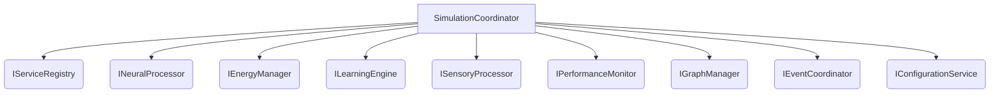

# Service-Oriented Architecture Analysis

This document provides a detailed analysis of the service-oriented architecture implemented in the `core/services` directory.

## 1. Service Interfaces

The service interfaces in the `core/interfaces` directory define the contracts for the services in the application. Each interface defines a set of methods that a service must implement, which allows for a clean separation of concerns and promotes loose coupling between components.

Key interfaces include:
- **[`IServiceRegistry`](core/interfaces/service_registry.py:55):** Defines the contract for service registration, resolution, and lifecycle management. This is the core of the dependency injection framework.
- **[`ISimulationCoordinator`](core/interfaces/simulation_coordinator.py:39):** Defines the main coordination contract for the simulation, providing the primary entry point for simulation execution.
- **[`IEnergyManager`](core/interfaces/energy_manager.py:62):** Defines the contract for energy management operations, handling energy flow, conservation, and metabolic costs.
- **[`INeuralProcessor`](core/-interfaces/neural_processor.py):** Defines the contract for neural processing, including spike generation and membrane potential updates.
- **[`ILearningEngine`](core/interfaces/learning_engine.py):** Defines the contract for learning and plasticity, including STDP and Hebbian learning.

## 2. Service Implementations

The services in the `core/services` directory provide concrete implementations of the service interfaces. Each service is responsible for a specific aspect of the simulation, and they are designed to be modular and interchangeable.

For example, the [`SimulationCoordinator`](core/services/simulation_coordinator.py:27) class implements the [`ISimulationCoordinator`](core/interfaces/simulation_coordinator.py:39) interface and is responsible for orchestrating the simulation by coordinating the other services.

## 3. Component Interactions

The services interact with each other through the `IServiceRegistry`, which is responsible for resolving service dependencies. The `SimulationCoordinator` is the central orchestrator, and it interacts with the other services to execute the simulation.

The following diagram illustrates the interactions between the key services:

## 4. Key Design Patterns

The service-oriented architecture uses several key design patterns:

- **Dependency Injection:** The `IServiceRegistry` is used to inject service dependencies into other services. This promotes loose coupling and makes the services easier to test and maintain.
- **Service Locator:** The `IServiceRegistry` acts as a service locator, providing a central point of access for all services.
- **Singleton:** Many of the services are registered as singletons, ensuring that there is only one instance of each service in the application.

## 5. Comparison to `SimulationManager`

The monolithic [`SimulationManager`](core/simulation_manager.py:66) is a single class that is responsible for all aspects of the simulation. This makes it difficult to test and maintain, and it is not as flexible as the service-oriented architecture.

The service-oriented architecture is a better design because it promotes loose coupling, separation of concerns, and modularity. This makes the application easier to test, maintain, and extend.